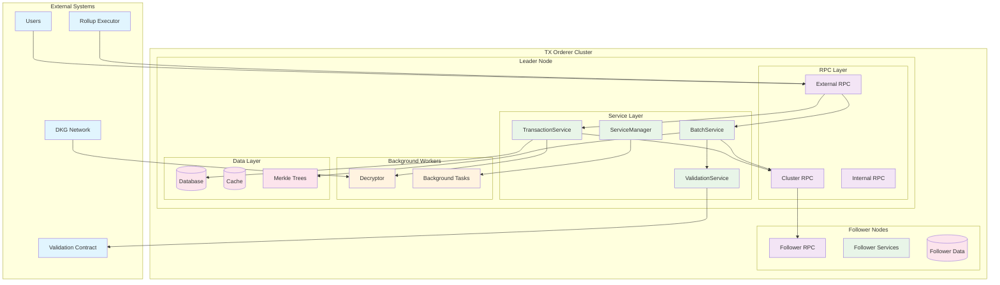
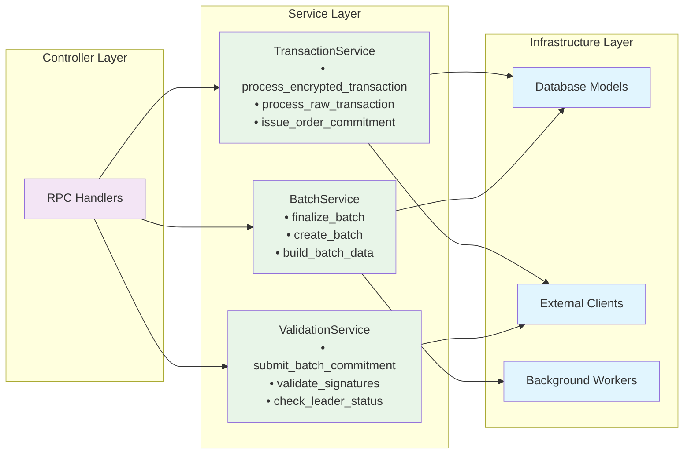
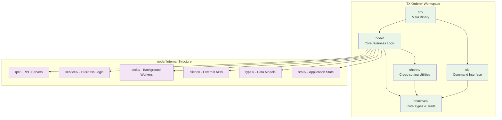
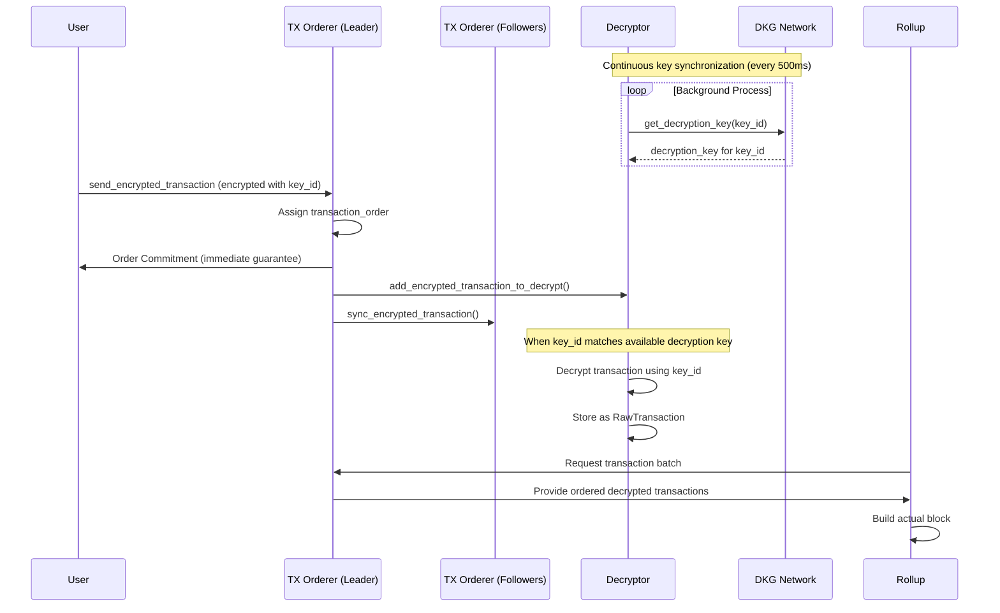

# TX Orderer

:warning: Under Construction
> This project is actively being developed. Breaking changes will occur until mainnet when we will start [Semantic Versioning](https://semver.org/).

Sequencing module for [Radius Block Building Solution](https://github.com/radiusxyz/radius-docs-bbs/blob/main/docs/radius_block_building_solution.md) written in Rust programming language.

## Installation & Quick Start

### Prerequisites
- Rust 1.70+ with Cargo
- Git

### Installation
```bash
# Clone the repository
git clone https://github.com/radiusxyz/tx_orderer.git
cd tx_orderer

# Build the entire workspace
cargo build

# Run the CLI to see available commands
cargo run -- --help
```

### Quick Start
```bash
# Initialize configuration
cargo run -- init

# Start a TX Orderer node
cargo run -- start

# Check version
cargo run -- --version
```

## Project Architecture

This is a **modular Rust workspace** consisting of 5 specialized crates:

```
tx_orderer/
├── src/                     # Main binary entry point
├── primitives/              # Core types, traits, and error definitions
├── shared/                  # Cross-cutting utilities (storage, crypto, merkle)
├── node/                    # Core business logic (RPC, tasks, clients, state)
└── cli/                     # Command-line interface
```

### Crate Responsibilities

- **`src/`**: Main binary that delegates to CLI
- **`primitives/`**: Fundamental types (Hash, Address, Platform), traits, and errors
- **`shared/`**: Shared utilities including storage abstractions, cryptographic operations, and merkle trees
- **`node/`**: Core TX Orderer functionality including RPC servers (internal/cluster/external), background tasks (decryptor, batch processor), external clients, and application state management
- **`cli/`**: Command-line interface with configuration management

## System Architecture

TX Orderer is built with a **service-oriented architecture** that provides a robust, scalable sequencing solution for blockchain ecosystems. The system operates in a leader-follower cluster model with clear separation of concerns across multiple layers.

### Overall System Structure



### Service Layer Architecture

The core innovation of TX Orderer is its **3-layer service architecture** that provides clear separation of concerns:



### Workspace Structure



### Architectural Benefits

Working in cluster with leader-based approach and service-oriented design brings the following benefits:

- **Simplicity**: Clear separation of concerns with dedicated services for specific business domains
- **Scalability**: Service layer enables independent scaling and optimization of different components  
- **Maintainability**: Each service has well-defined responsibilities and interfaces
- **Efficiency**: Leader-based sequencing reduces consensus overhead while service layer optimizes processing
- **Extensibility**: New features can be added by extending existing services or creating new ones

### Key Components

- **TX Orderer Leader**: 
  - Receives encrypted transactions and assigns transaction order
  - Issues order commitments to users immediately (guarantees transaction inclusion)
  - Manages transaction decryption through Decryptor component
  - Provides ordered transaction batches to rollups for block building

- **TX Orderer Followers**: 
  - Forward encrypted transactions to leader
  - Validate block commitments made by the leader
  - Participate in cluster consensus

- **Decryptor**: 
  - Continuously receives decryption keys from DKG network (every 500ms)
  - Decrypts transactions when corresponding key_id becomes available
  - Stores decrypted transactions for batch creation

- **DKG Network**: 
  - Distributed Key Generation system
  - Manages session-based encryption/decryption keys
  - Provides decryption keys to TX Orderer nodes

- **Rollup**: 
  - Selects TX Orderer cluster leader
  - Requests transaction batches from TX Orderer
  - Builds actual blocks using ordered transactions

### Transaction Flow



## Encrypted Transaction and Order Commitment

TX Orderer processes two types of encrypted transactions:
- [PVDE](https://ethresear.ch/t/mev-resistant-zk-rollups-with-practical-vde-pvde/12677) encrypted transaction
- [SKDE](https://ethresear.ch/t/radius-skde-enhancing-rollup-composability-with-trustless-sequencing/19185) encrypted transaction

When a user sends an encrypted transaction (encrypted with a specific session `key_id`), the TX Orderer leader immediately assigns a transaction order and issues an **order commitment** back to the user. This order commitment guarantees that the transaction will be included in the specified position without the need to decrypt it first.

The session-based encryption mechanism ensures that transactions can only be decrypted when the corresponding decryption key becomes available from the DKG network. The order commitment includes critical details such as:
- Exact promised order of the transaction within the batch
- Rollup batch number
- Transaction hash
- TX Orderer's signature

These elements serve as cryptographic evidence of the original commitment made by the TX Orderer, providing users with strong guarantees against transaction reordering.

## Batch Creation and Validation

When rollup executors request a block, the TX Orderer provides **ordered transaction batches** composed of decrypted transactions. The rollup then uses these batches to build the actual blocks.

### Validation Process
1. **Batch Creation**: TX Orderer leader creates batches of decrypted transactions with guaranteed ordering
2. **Batch Commitment**: Leader submits a batch commitment (Merkle root) to the Validation Contract
3. **Follower Validation**: Followers receive the submission event and respond to the same contract with a boolean response indicating whether the batch made by the leader is valid
4. **Block Building**: Rollup builds the final block using the validated transaction batch

## Development Commands

### Building
```bash
# Build entire workspace
cargo build

# Build specific crates
cargo build -p tx-orderer-primitives
cargo build -p tx-orderer-node
cargo build -p tx-orderer-cli

# Check compilation without building
cargo check
```

### Testing
```bash
# Run all tests
cargo test

# Test specific crate
cargo test -p tx-orderer-node

# Run tests with output
cargo test -- --nocapture
```

### Running
```bash
# Show CLI help
cargo run -- --help

# Initialize configuration
cargo run -- init

# Start TX Orderer node
cargo run -- start

# Use binary name directly
cargo run --bin tx_orderer -- start
```

## Configuration

TX Orderer uses TOML configuration files for setup. Configuration can be initialized and managed through the CLI:

```bash
# Generate default configuration
cargo run -- init

# Start with custom configuration
cargo run -- start --config /path/to/config.toml
```

### Example Configuration Structure
- Node configuration (role, data directory)
- Network settings (ports, addresses)
- RPC server configuration
- External service endpoints (DKG, rollup, validation)
- Encryption settings (PVDE/SKDE parameters)

## API Documentation

TX Orderer provides three types of RPC servers:

### External RPC (User-facing)
- `send_encrypted_transaction`: Submit encrypted transactions and receive order commitments
- `get_order_commitment`: Retrieve order commitment for specific transactions
- `get_encrypted_transaction_*`: Query encrypted transaction data
- `get_raw_transaction_*`: Query decrypted transaction data
- `get_rollup`: Get rollup information
- `get_version`: Get TX Orderer version

### Cluster RPC (Inter-node communication)
- `sync_encrypted_transaction`: Synchronize encrypted transactions between nodes
- `sync_batch_creation`: Synchronize batch creation across cluster
- `set_leader_tx_orderer`: Update cluster leader information
- `add_mev_searcher_info`: Manage MEV searcher connections

### Internal RPC (Administrative)
- `add_sequencing_info`: Configure sequencing parameters
- `add_validation_info`: Configure validation settings
- `add_cluster`: Add new cluster configuration
- `get_cluster_*`: Query cluster information

## Contributing
We appreciate your contributions to our project. Visit [issues](https://github.com/radiusxyz/tx_orderer/issues) page to start with or refer to the [Contributing guide](https://github.com/radiusxyz/radius-docs-bbs/blob/main/docs/contributing_guide.md).

## Getting Help
Our developers are willing to answer your questions. If you are first and bewildered, refer to the [Getting Help](https://github.com/radiusxyz/radius-docs-bbs/blob/main/docs/getting_help.md) page.
